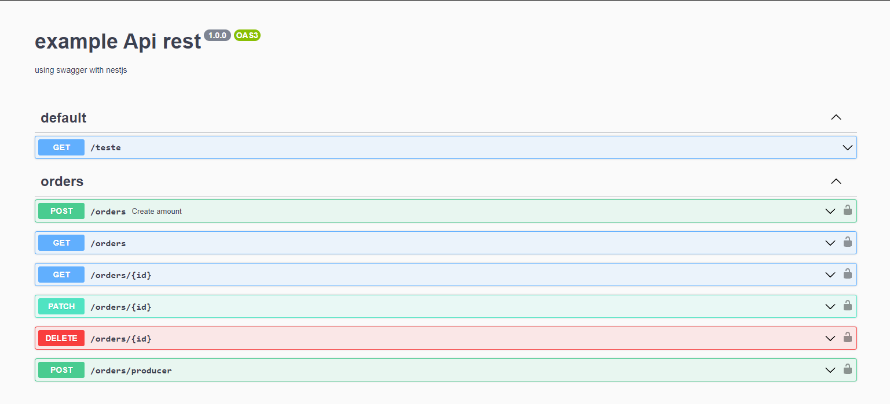
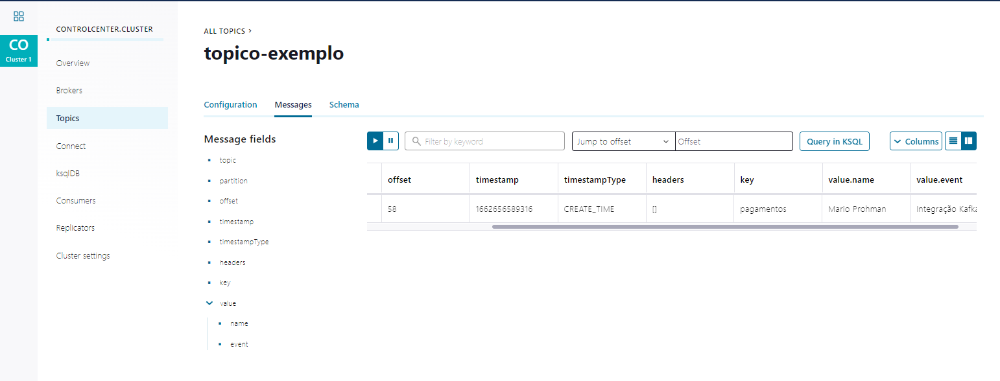

# kafka-nestjs
Kafka Integration with Nestjs

## About the repository
In this repository you will find a nestjs application with microservices integration (kafka), along with the swagger documentation.

## Run the application

Run the commands:

```bash
docker-compose up
```

Access http://localhost:3000 in your browser. Use the `api.http` file (Rest Client) to test the application.


### Access the browser http://localhost:3000/api. To view Swagger documentation.

<br>


### Access http://localhost:9021 in your browser. To access the kafka dashboard.


